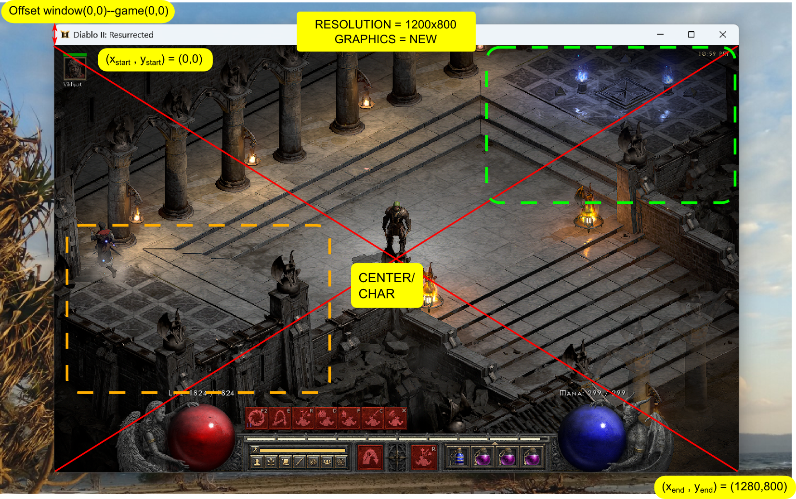

# Andrzej 2 Resurrected
### Andrzej uczy się grać w D2R

Do czasu lepszego rozwiazania, poruszanie sie po grze bedzie dzialac na zasadzie:
- "znajdz okreslony element na odpowiednim miejscu" (zadanym obszarze), unikalnym dla każdej lokalizacji.
- Innymi słowy, każda lkalizacja (skrzynka, centrum miasta, wp, sklep, hazard) będzie miała swój 'odcisk'.
- Głównym domem andrzeja będzie Akt 4 - najkrótszy dystans do wskrzeszenia marce, skrzynki, caina, sklepu, wp

Dla przykładu centrum miasta akt4:
- Aby mieć pewność, że Andrzej stoi w pozycji startowej po zalogowaniu LUB po prostu wszedł na obszar środkowy miasta w akcie 4:
    - WP musi się znajdować w zielonym prostokącie
    - gargulce muszą się znajdować w pomarańczowym prostokącie
 

### To-do
- Bieganie (np srzkynka --> Jamelia)
- Depozyt golda do skrzynki
