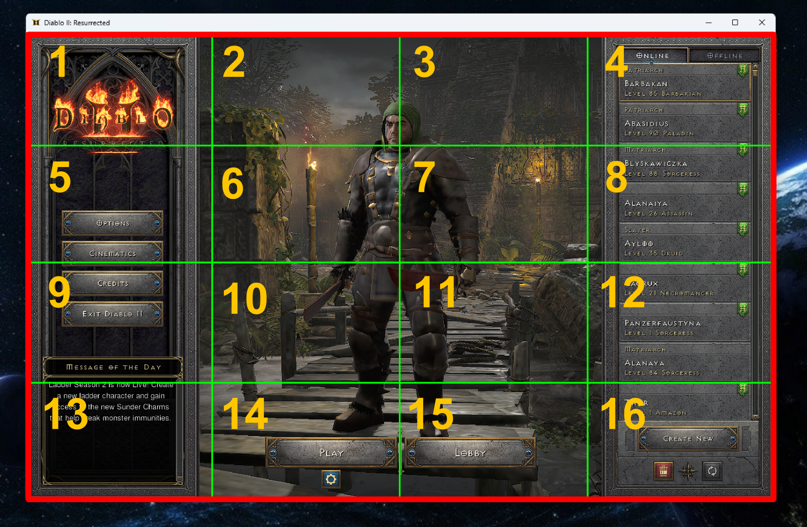

# Andrzej 2 Resurrected
### Andrzej uczy się grać w D2R

Do czasu lepszego rozwiazania, poruszanie sie po grze bedzie dzialac na zasadzie "znajdz okreslony element na odpowiednim miejscu" (zadanym obszarze), unikalnym dla każdej lokalizacji. Innymi słowy, każda lkalizacja (skrzynka, centrum miasta, wp, sklep, hazard) będzie miała swój 'odcisk' w postaci obrazka.png.
- **WYMIARY OKNA / ROZDZIELCZOSC - 1200x800 px** (niezbedna do prawidlowego dzialania!!!)
- Ekran podzielony na **16 regionów**, kazdy o rozdzielczosci **300x200 px**
- W celu umozliwienia andrzejowi szybkiej pracy, podczas projektowania skryptow (waypointy/sklep/itemy/leczenie) nalezy uwzglednic w jakim regionie (1-16) andrzej ma szukac

 

## Głównym domem andrzeja będzie Akt 4
- najkrótszy dystans do wskrzeszenia merca, skrzynki, caina, sklepu, wp
- Aby mieć pewność, że Andrzej stoi w pozycji startowej po zalogowaniu LUB po prostu wszedł na obszar środkowy miasta w akcie 4:
    - WP musi się znajdować w zielonym prostokącie
    - gargulce muszą się znajdować w pomarańczowym prostokącie

### To-do
- [x] game_start()
- [ ] stash
- [ ] aha
- [ ] Bieganie (np srzkynka --> Jamelia)
- [ ] Depozyt golda do skrzynki
- [ ] PODARNIK - jak ustawic bota (python/pycharm)

#### changelog
**03/02**
- podstawowe funkcje
**23/01**
- koronetkowanie na hazardzie 
