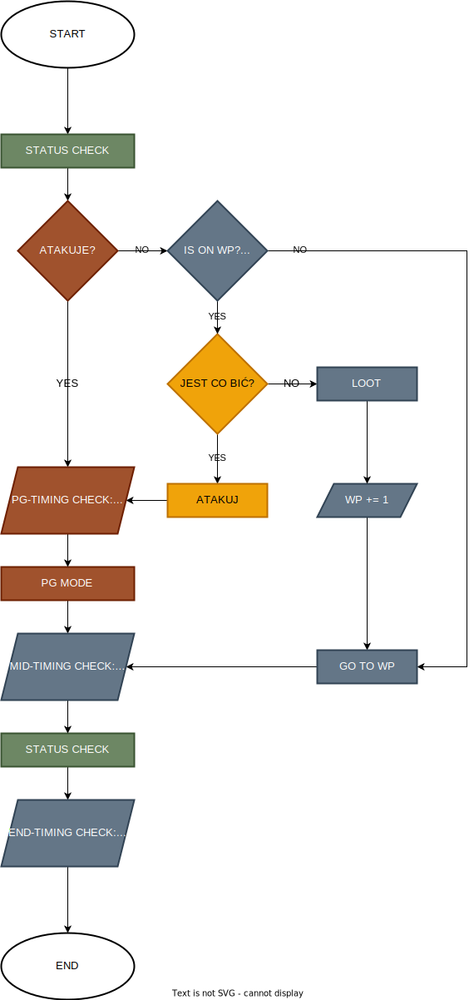
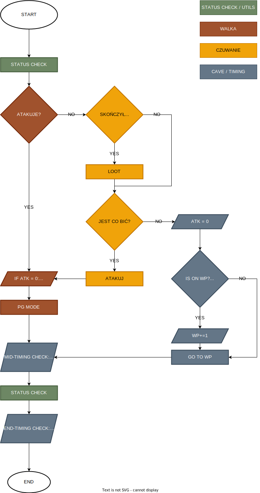

# Andrzej
Andrzej walczy z potworami! Teraz może działać na dwa sposoby - profit i PG.

### LOGIKA 
| Algorytm 'PG'                      | Algorytm 'Profit                        |
|------------------------------------|-----------------------------------------|
| Andrzej ZAPIERDALA do WP, staje na środku i zaczyna wywijać bronią + rotacja czarów. Jeśli wymaga tego konieczność, rzuca Exeta Res aby moby nie uciekały. Po wyeliminowaniu zagrożenia lootuje i idzie do następnego WP. Wymaga no-follow-mode. | Andrzej stale sprawdza, czy na BW są jakieś potwory. Jeśli tak to atakuje, po zabiciu każdego potwora lootuje. Jeśli niebezpieczeństwo zostało wyeliminowane, idzie do WP. Wymaga follow-mode. |
|  |  |

### To-do:
- [x] Algorytm 'Profit'
- [ ] Zamienić szukanie WP w centrum minimapy na szukanie w obszarze dookoła centrum (+/- 2-3 px), aby akceptował też sąsiednie SQMy - potrzebne na wypadek kiedy potwór stoi na WP i nie chce się przesunąć.
- [x] Zmienić pyautogui.locateonscreen na własną funkcję opencv2 (6+ razy szybciej). Umożliwi to maksymalną optymalizację leczenia (status checks) i rotacji (exori/exori gran/exori mas).
- [x] is_allright_opencv - 6+ razy szybciej, nawet na 4k!
- [x] is_bije_opencv
- [ ] is_co_bic_opencv
- [ ] pg_mode_opencv
- [ ] is_on_wp_opencv
- [ ] go_to_wp_opencv
