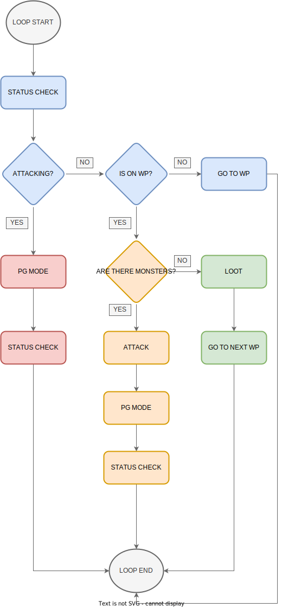

# Andrzej
Andrzej BEDZIE walczyl z potworami, obecnie przygotowuje się do walki. In this hunting style Andrew runs to the WP igoring (luring?) monster and once reached WP starts exoring the shit out of them.
### DEFINITION #
The aim of this branch is to introduce an optimized script for efficient and deadly hunting with maximum dmg output.
To achieve this the main loop must be short enough to not extend any ability/spell CDs.
Since deadly hunting is a two-edged sword, healing must also be maximized. 
Andrew must ensure appropriate timing between each status check (hplow check, manahigh etc.)

### Overview:
- so far each status check is about 0.25-0.35 s long... (less spread would be great)
- attacking new monster loop is ~ 2.7 s (with 2 status checks! OK but room for improvement)
- continuing attacking loop is ... (probably around 2 s, so on target!, but check status timing!)
- on WP, no monsters and LOOT loop is 3 s (OK)
 
### To-do:
- [x] add flowchart_idea.img
- [x] datetime checks for each module duration
- [x] total attacking loop duration must be 2-2.1 s (maybe 2.1 even better to ensure the EK hits with meelee first?)
- [x] 1 s CD for healing spells, so ideally the main loop will contain 2x status checks (is_allright() method)
- [x] make sure status checks are once every ~1.1 s
- [ ] in case monster is standing on WP, expand WP check to 1 adjacent SQM (+/- 1 px?)
- [ ] add rush_wp - utani hur after finished killing/looting to rush to next WP
