# Caves

Table of content:

| Cave                                              |    City     | Lvl | exp/h |   gp/h | Mode         | Loot                                                                                                                                                                                                                                                                                                                                                                                                                                                                                                                                                                                                                  |
|---------------------------------------------------|:-----------:|----:|------:|-------:|--------------|-----------------------------------------------------------------------------------------------------------------------------------------------------------------------------------------------------------------------------------------------------------------------------------------------------------------------------------------------------------------------------------------------------------------------------------------------------------------------------------------------------------------------------------------------------------------------------------------------------------------------|
| [Swamp Trolls Venore](#venore_swamp_trolls)       |   Venore    |   8 |    ?? |     ?? | Profit       |                                                                                                                                                                                                                                                                                                                                                                                                                                                                                                                       |
| [Swamp Trolls Port Hope](#port_hope_swamp_trolls) |  Port Hope  |   8 |   20k |    50k | Profit       |                                                                                                                                                                                                                                                                                                                                                                                                                                                                                                                       |
| [Frogs](#laguna_frogs)                            | Liberty Bay |   8 |    ?? |     ?? | Profit       |                                                                                                                                                                                                                                                                                                                                                                                                                                                                                                                                             |
| [Turtles](#Turtles)                               | Liberty bay |  30 |   70k |    80k | Profit       |                                                                                                                                                                                                                                                                                                                                                                                                                             |
| [Banuta monkeys](#banuta-2)                       |  Port Hope  |  35 |    ?? |     ?? | Profit       |  [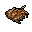](https://tibia.fandom.com/wiki/Ape_Fur)                                                                                                                                                                                                                                                                                                                                                                                                                                                               |
| [Cult cave](#cult_cave)                           | Liberty bay |  40 |   90k |   100k | Profit       |  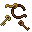                                                                                                                                                                                                                                                                                                                                                                                                      | 
| [Darashia Dragons](#darashia_dragons)             |  Darashia   |  60 |  200k |     ?? | Profit       |                                                                                                                                                                                                                                                                                                                                                                                                                                                                                                                                             |
| [Pirates](#yala_pirates)                          |   Yalahar   |  80 |  150k |   100k | Profit+PG    | 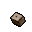 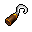 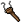 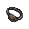                                                                                                                                                                                                                                                                                                                                                                                                                                                                                     |
| [Mutated Tigers](#mutated_tigers)                 |     Zao     |  80 |  250k |   100k | Profit+PG    |                                                                                                                                                                                                                                                                                                                                                                                                                                                                                                                                   |
| [Crystal spiders](#crystal_spiders)               |  Svargrond  |  90 |  200k |    30k | Profit       |                                                                                                                                                                                                                                                                 |
| [Wyrms](#drefia_wyrms)                            |  Darashia   |  90 |  550k |      0 | Profit       |                                                                                                                                                                                                                                                                                                                                                                         |
| [Forst dragons](#okolnir_west)                    |  Svargrond  | 100 |  400k |    > 0 | Profit       | [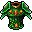](https://tibia.fandom.com/wiki/Dragon_Scale_Mail)                                                                                                                                                                                                                                                                                                                      |
| [Vampire crypt](#vampire_crypt)                   |    Edron    | 120 |  600k |   150k | Full PG      | [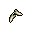](https://tibia.fandom.com/wiki/Vampire_Teeth)                                                                                                                                                                                                                                                                                                                                               |
| [Sea Serpents](#sea_serpents)                     |  Svargrond  | 130 |  800k |      0 | Full PG      |       |
| [Putrid mummy](#putrid_mummies)                   |  Darashia   | 150 |  600k | 213.7k | Full PG      |                                                                                                                                                                                                                                                                                                                                                                                                                                                                                                     |                                                                                                                                                                                                                                                                                                                                                                                                                                                                                                                                                                                                                
| [Elder Wyrms](#drefia_elder_wyrms)                |  Darashia   | 200 | 1.3kk |   >50k | PG+Bloodrage |                                                                                                                                                                                                                                                                                                                                                                         |

> Note: lets keep it sorted by level.

***
***
[Back to Caves](#caves)

<h3 id="Turtles">Turtles @ Laguna island</h3>

File: [zolwie.py](zolwie.py)

>Note: **Bloody pincers!** Waypoints are at rope spots/dig holes.

---
[Back to Caves](#caves)

<h3 id="crystal_spiders">Crystal spiders @ Svargrond</h3> 

File: [any_7.py](any_7.py)

>Note: Ice golems should be on top of battle list as they tend to lower skills with their special attacks.

---
[Back to Caves](#caves)

<h3 id="banuta-2">Monkeys @ Banuta -2</h3>

File: [any_8.py](any_8.py)

>Note: **Ape furs!** DO NOT exori cuz Kongras will run fuck knows where. Slow and steady, resp there is shit anyways.
---
[Back to Caves](#caves)

<h3 id="darashia_dragons">Dragons @ Darashia</h3>

File: [any_7.py](any_7.py)

>Note:

---
[Back to Caves](#caves)

<h3 id="venore_swamp_trolls">Swamp Trolls @ Venore</h3>

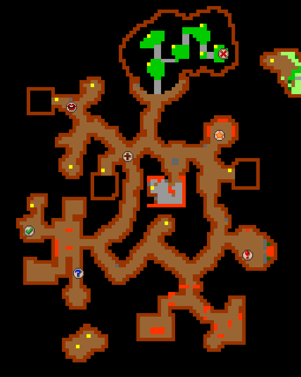

File: [venore_swamp_trolls.py](venore_swamp_trolls.py)

>Note: Drop items from bp for FACC supported 

---
[Back to Caves](#caves)

<h3 id="cult_cave">Cult Cave @ Liberty Bay</h3>

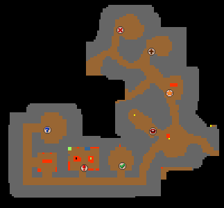

File: [any_7.py](any_7.py)

>Note: **Rope belts!** 2x basic life/mana leech imbu enough for healing + utani hur manaburn to speed up

---
[Back to Caves](#caves)

<h3 id="yala_pirates">Pirates @ Yalahar</h3>

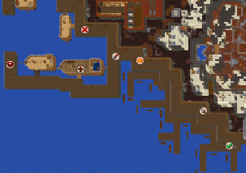
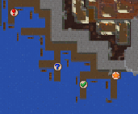

File: [any_9.py](any_9.py)

>Note: 2x basic life/mana leech imbu enough for healing + utani hur manaburn to speed up Profit+PG

---
[Back to Caves](#caves)

<h3 id="vampire_crypt">Vampire Crypt @ Edron</h3>

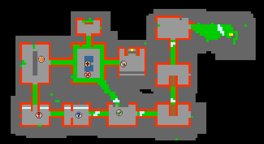
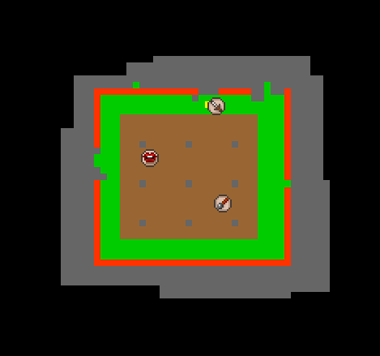

File: [edron_vamp_cave.py](edron_vamp_cave.py)

<h4 id='vampire_crypt2'>Vampire Crypt v.2 for higher lvl/slower resp</h4>

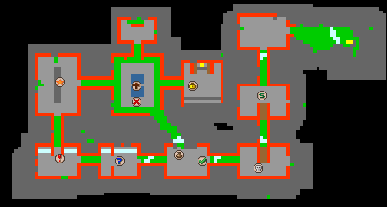
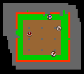

File: [edron_vamp_cave_Hlvl.py](edron_vamp_cave_Hlvl.py)

>Note:  **Vampire teeths!** Full imbu and potions, good exp, amazing loot

---
[Back to Caves](#caves)

<h3 id="sea_serpents">Sea Serpents @ Svargrond</h3>

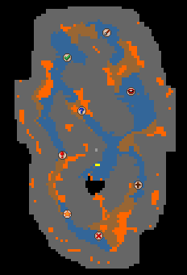

File: [any_8.py](any_8.py)

>Note: Full imbu and potions, good exp

---
[Back to Caves](#caves)

<h3 id="mutated_tigers"> Mutated Tigers @ Zao</h3>

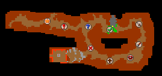

File: [any_9.py](any_9.py)

>Note: **Sabretooths!**, intricate imbu + 400 SHP/h

---
[Back to Caves](#caves)

<h3 id="okolnir_west"> Frost dragons @ okolnir west</h3>

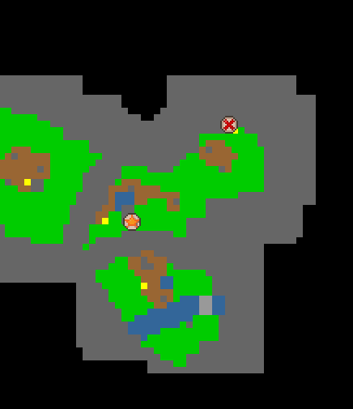
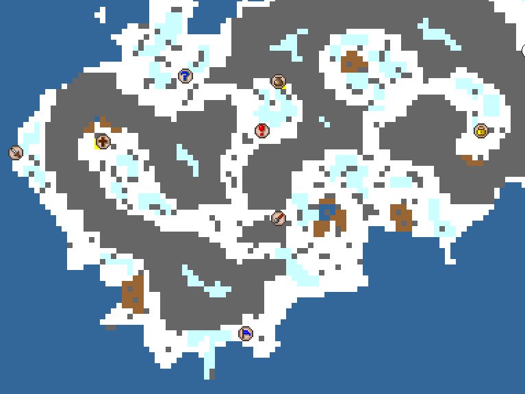
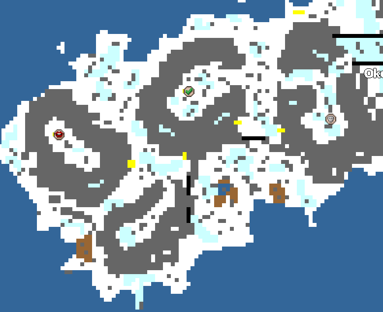

File: [svargrond_okolnir.py](svargrond_okolnir.py)

>Note: Don't go there unless there are boosted frost dragons or you have pray for both. Waste and shitty exp.  

---
[Back to Caves](#caves)

<h3 id="drefia_wyrms"> Drefia Wyrms -1</h3>

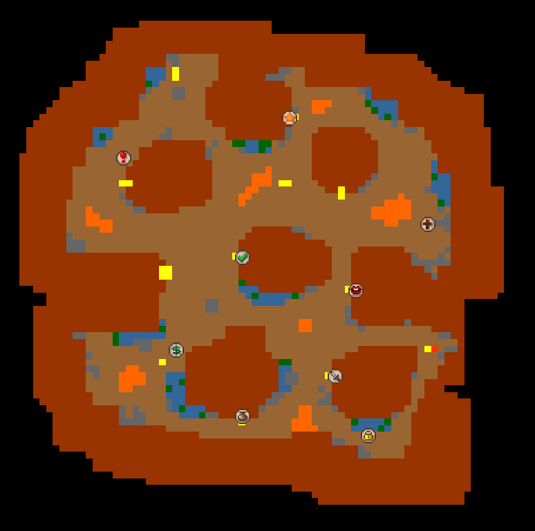
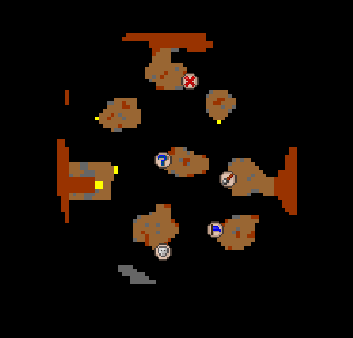

File: [darashia_wyrms.py](darashia_wyrms.py)

>Note: Loot there its either 0, or +25k if u got composite hornbow. Know issue: Adnrew my stuck during often going uphill/downhill.

---
[Back to Caves](#caves)

<h3 id="laguna_frogs"> Frogs @ laguna island</h3>

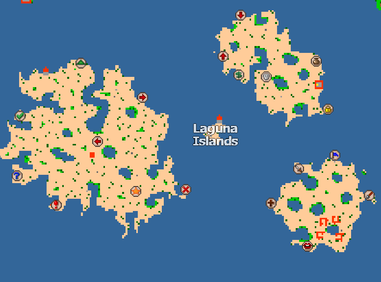

File: [liberty_bay_laguna_islands.py](liberty_bay_laguna_islands.py)

>Note: Needs to be supervised cuz its follow seagulls and green frogs. Rather for bestiary only.

---
[Back to Caves](#caves)

<h3 id="drefia_elder_wyrms"> Elder Wyrms @ Drefia</h3>

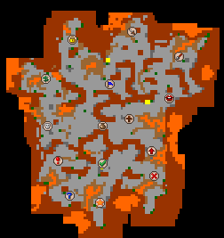

File: [any_15.py](any_15.py)

>Note: Good chance to test full power of EK! Full PG+bloodrage, 1200 SMP & 100 UHP + T3 imbu (2xLL, 1xcrit, 1xML)

---
[Back to Caves](#caves)

<h3 id="putrid_mummies"> Putrid Mummies @ Darashia</h3>

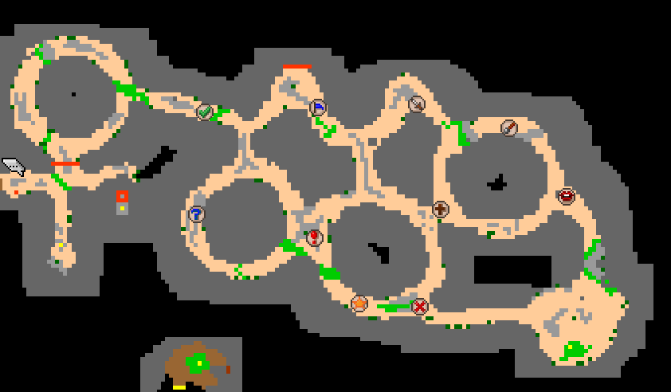

File: [any_10.py](any_10.py)

>Note: They hit like crazy.

