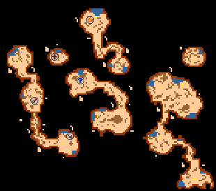
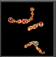
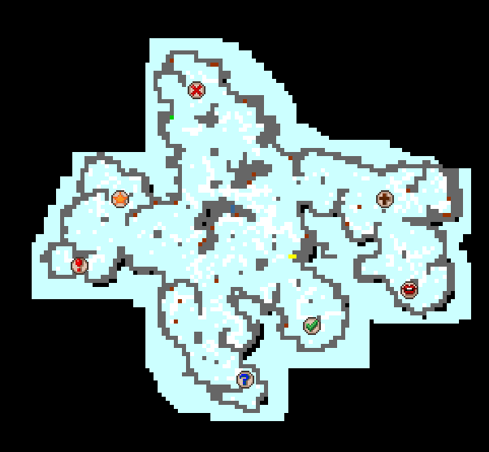
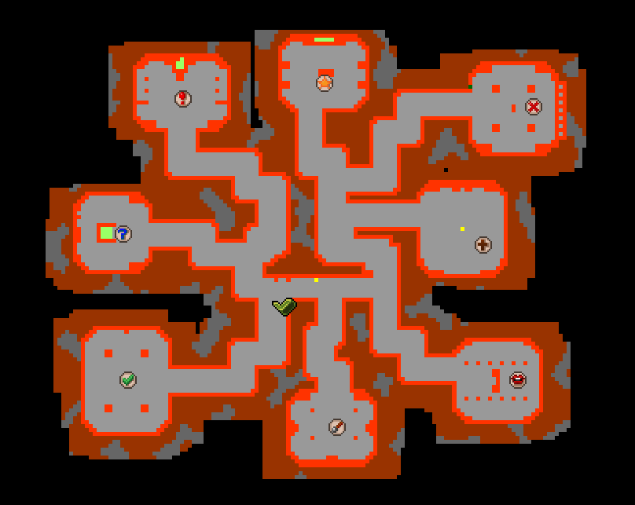
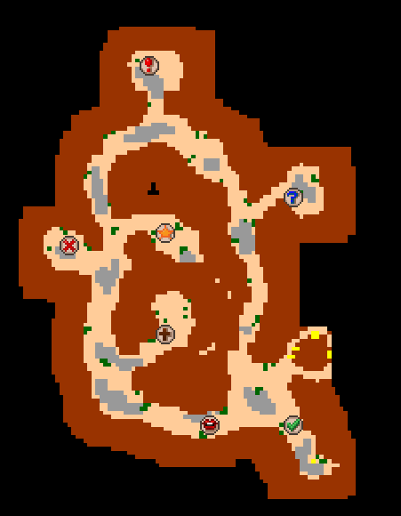

## Caves 

{:toc}

| Cave                                  |    City     | Lvl | exp/h | gp/h | Mode   |
|---------------------------------------|:-----------:|----:|------:|-----:|--------|
| [Turtles](#Turtles)                   | Liberty bay |  30 |    ?? |   ?? | Profit |
| [Crystal spiders](#crystal_spiders)   |  Svargrond  |  90 |  200k |  30k | Profit |
| [Banuta monkeys](#banuta-2)           |  Port Hope  |  ?? |    ?? |   ?? | Profit |
| [Darashia Dragons](#darashia_dragons) |  Darashia   |  ?? |  200k |   ?? | Profit |

---

<h3 id="Turtles">Turtles @ Laguna island</h3>

File: [zolwie.py](zolwie.py)

>Note: Waypoints are at rope spots/dig holes.

<h3 id="crystal_spiders">Crystal spiders @ Svargrond</h3> 

File: [any_7.py](any_7.py)

>Note: Ice golems should be on top of battle list as they tend to lower skills with their special attacks.

<h3 id="banuta-2">Monkeys @ Banuta -2</h3>

File: [any_8.py](any_8.py)

>Note: DO NOT exori cuz Kongras will run fuck knows where. Slow and steady, resp there is shit anyways.

<h3 id="darashia_dragons">Dragons @ Darashia</h3>

File: [any_7.py](any_7.py)

>Note: